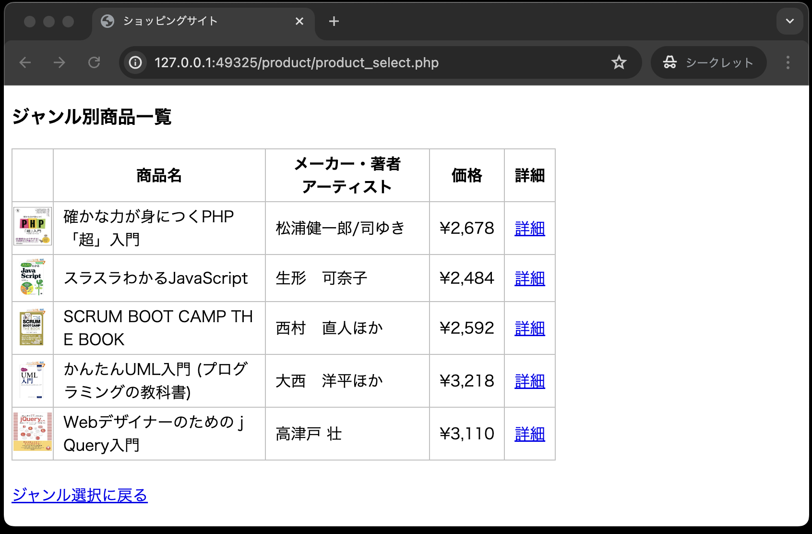

# イントロダクション

本章では、Webアプリケーション「ミニショップ」の作成を通して、Webアプリケーションの作り方やオブジェクト指向を利用したプログラミングの書き方を学んでいきます。

## 狙い

1. Webアプリケーションの作り方を学ぶ
1. オブジェクト指向を利用したプログラミングの書き方を学ぶ
1. 仕様書に則り実装する力を身に着ける

## 仕様書の配布

ソースコードはGitHub、授業資料については、順次Google Classroomにアップします。

Webアプリケーション「ミニショップ」の作成に関しては、各自が仕様書を読んで、実装作業を行っていくことになります。
資料に書かれている内容や作業途中で発生したエラーについての質問はいつでも受け付けます。

- 仕様書① : ジャンル選択画面、ジャンル別商品一覧画面
- 仕様書② : 商品詳細画面
- 仕様書③ : カート内の商品画面、カート内の商品画面のバグ修正
- 仕様書④ : カート内の商品を削除する、カート内の商品の注文数を変更する
- 仕様書⑤ : 注文画面

## コード資料について

「仕様書①」には、実装する内容に関するすべてのコードが記載されています。

「仕様書②」以降の資料については、部分的なコード、もしくは仕様書のみが記載されていますので、自分でコードを考え書く必要があります。

※コードについては、仕様書の公開後、コードについての補足資料を公開します。

## 課題提出方法

今までの課題同様、GitHubにpushし、自動採点に合格することで提出とみなします。
提出のタイミングは、Webアプリケーション「ミニショップ」の3つの機能がそれぞれ完成したタイミングで提出してください。

仕様書と機能の対応は以下の通りです。

- 商品に関する機能
  - 仕様書① : ジャンル選択画面、ジャンル別商品一覧画面
  - 仕様書② : 商品詳細画面 ← ここで課題提出

- カートに関する機能
  - 仕様書③ : カート内の商品画面、カート内の商品画面のバグ修正
  - 仕様書④ : カート内の商品を削除する、カート内の商品の注文数を変更する ← ここで課題提出

- 注文に関する機能
  - 仕様書⑤ : 注文画面 ← ここで課題提出

## 課題提出期限

各種機能の最後の資料が公開されるタイミングで、提出期限を公開します。
例えば、商品に関する機能の課題提出期限は、仕様書②が公開されたタイミングで公開します。

## 画面サンプル

### ◆ジャンル選択画面

- パソコン、ブック、ミュージックの３つのジャンルをラジオボタンで表示する
- ブックにデフォルトチェックが入っている 

### ◆ジャンル別商品一覧画面

- 選択されたジャンルの商品概要を一覧で表示する
- 各商品にはそれぞれの詳細画面へのリンクがある 
  

### ◆商品詳細画面

- ジャンル別商品一覧から選択された商品の詳細画面を表示する
- 注文数のプルダウンメニューとカートに入れるためのボタンがある 
  

### ◆カート内の商品画面

- カート内に保存されている商品を表示する
- 注文数の変更、特定の商品の削除ができる
- カート内の商品を注文するためのリンクがある 
  

### ◆注文画面

- 注文した商品を表示する 
  