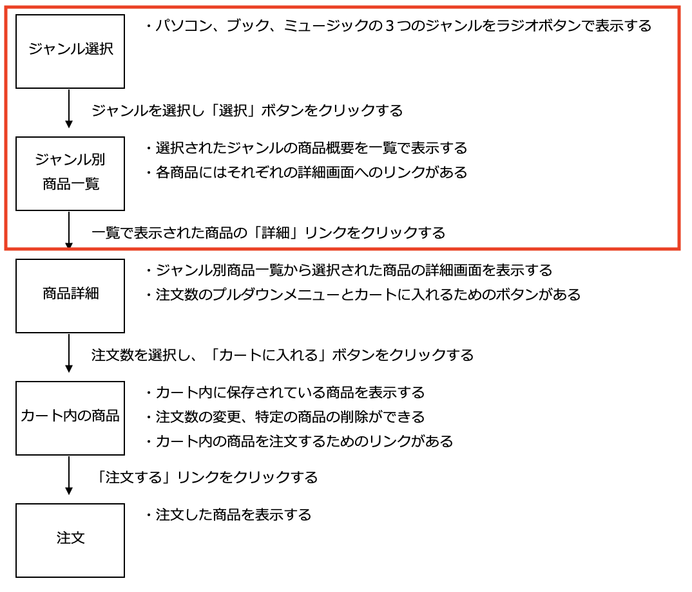
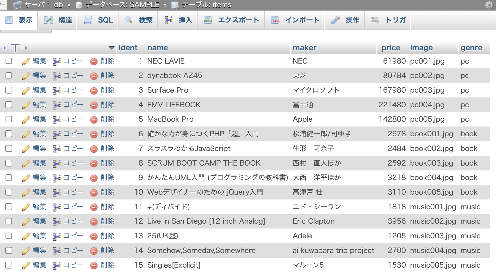
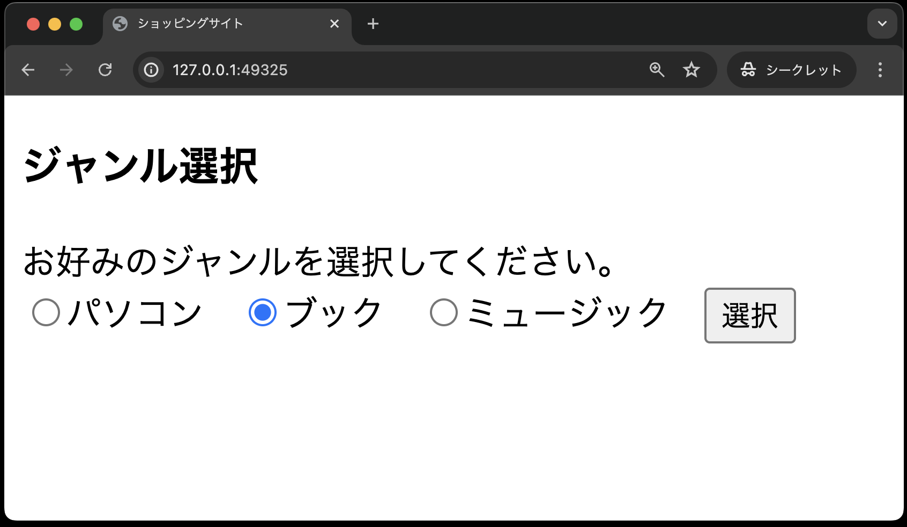
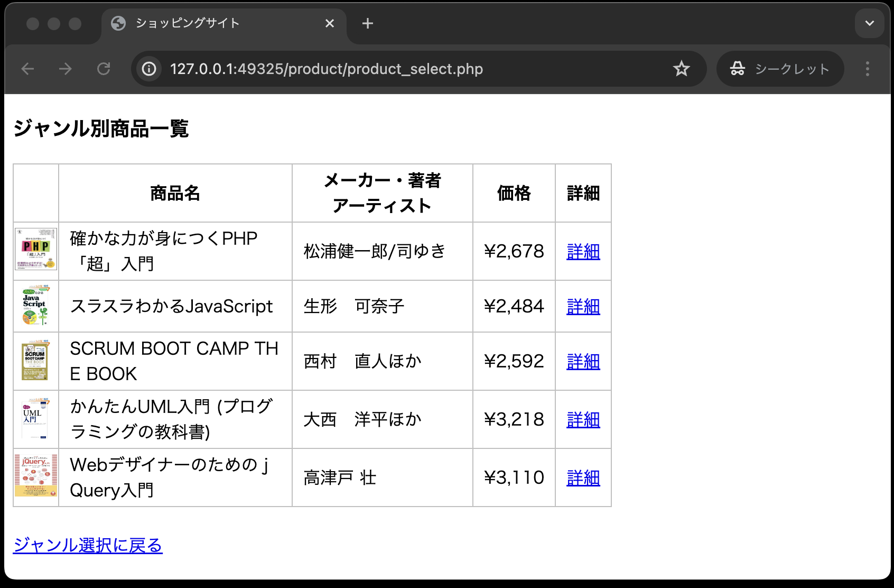

# 仕様書① : ジャンル選択画面、ジャンル別商品一覧画面

## やること

本章では、以下の2つの画面を作成します。



## 本章で使用するテーブルについて

使用するテーブルは、以下の通りです。

**テーブル名：items**

以下はテーブル構造です。

| カラム名 | データ型 | 制約 | 備考 |
| - | - | - | - |
|ident|int型|主キー、not null制約|商品番号|
|name|varchar型|最大文字数50、not null制約|商品名|
|maker|varchar型|最大文字数50、not null制約|メーカー・著者・アーティスト|
|price|int型||価格|
|image|varchar型|最大文字数20|画像名|
|genre|varchar型|最大文字数10|ジャンル|

また、初期データとして以下のものが登録されています。
量が多いため、phpMyAdmin上で確認してください。



## ジャンル選択画面(index.php)

- パソコン、ブック、ミュージックの３つのジャンルをラジオボタンで表示する
- ブックにデフォルトチェックが入っている<br>


ジャンル選択画面(`index.php`)のジャンルを選択し、「選択」ボタンをクリックすると、ジャンル別商品一覧画面(`product_select.php`)に遷移します。

**index.php**

```php
<!DOCTYPE html>
<html lang="ja">

<head>
    <meta charset="UTF-8">
    <meta name="viewport" content="width=device-width, initial-scale=1.0">
    <title>ショッピングサイト</title>
    <link rel="stylesheet" href="css/minishop.css">
</head>

<body>
    <h3>ジャンル選択</h3>
    お好みのジャンルを選択してください。<br>
    <form method="POST" action="product/product_select.php"> <!-- ① -->
        <label><input type="radio" name="genre" value="pc">パソコン</label>&nbsp;&nbsp; <!-- ② -->
        <label><input type="radio" name="genre" value="book" checked>ブック</label>&nbsp;&nbsp;
        <label><input type="radio" name="genre" value="music">ミュージック</label>&nbsp;&nbsp;
        <input type="submit" value="選択">
    </form>
</body>

</html>
```

**【解説】**

①: `<form method="POST" action="product/product_select.php">`

`action`属性のパスの記載方法は相対パスとなっています。
この場合、index.php から見て product_select.php は「product」ディレクトリ内にあるため、パスの記載は「product/product_select.php」となります。

②: `<label><input type="radio" name="genre" value="pc">パソコン</label>&nbsp;&nbsp;`

`<label></label>`タグでラジオボタンを囲むことにより、「パソコン」という文字をクリックしてもラジオボタンが選択されます。

## データベースの基本事項を定義するクラスDbData

`$dsn`、`$user`、`$password` の値がWebアプリケーション「ミニショップ」用になっている以外は、[ログイン認証](https://2025web1.github.io/10-login/)で作成したクラス`DbData`と同じ内容です。

`dbdata.php`のコードは以下のとおりです。
`public`ディレクトリに`classes`ディレクトリを作成し、その中に配置してください。

**classes/dbdata.php**

```php
<?php
// DbDataクラスの宣言
class DbData
{
    // PDOオブジェクト用のプロパティ(メンバ変数)の宣言
    protected $pdo;

    // コンストラクタ
    // 「__construct」の「̲̲__」は「_(アンダースコア)」を2つ記述する
    public function __construct()
    {
        // PDOオブジェクトを生成する
        $user = 'sampleuser';
        $password = 'samplepass';
        $host = 'db';
        $dbName = 'SAMPLE';
        $dsn = 'mysql:host=' . $host . ';dbname=' . $dbName . ';charset=utf8';
        try {
            $this->pdo = new PDO($dsn, $user, $password);
        } catch (Exception $e) {
            // 接続できなかった場合のエラーメッセージ
            exit('データベースに接続できませんでした：' . $e->getMessage());
        }
    }

    // SELECT文実行用のqueryメソッド ・・・このメソッドはユーザー定義関数
    protected function query(string $sql, array $array_params): PDOStatement
    {
        $stmt = $this->pdo->prepare($sql);
        $stmt->execute($array_params);
        // PDOステートメントオブジェクトを返すので
        // 呼び出し側でfetchメソッド、またはfetchAllメソッドで結果セットを取得
        return $stmt;
    }

    // INSERT、UPDATE、DELETE文実行用のメソッド ・・・このメソッドもユーザー定義関数
    protected function exec(string $sql, array $array_params): PDOStatement
    {
        $stmt = $this->pdo->prepare($sql);
        // 成功:true、失敗:false
        $stmt->execute($array_params);
        // 【今回追記】実行結果(true or false)を利用するので、戻り値を返す
        return $stmt;
    }
}
```

## 商品データを操作するクラスProduct

データベースの基本事項を定義するクラス`DbData`を継承し、商品データを操作するクラス`Product`を定義します。

今回は、選択されたジャンルの商品データを抽出する`getItems`メソッドを、以下の条件でクラス`Product` に定義します。
`puclic`ディレクトリの`classes`ディレクトリに配置してください。

```text
アクセス修飾子： public
メソッド名： getItems
引数： $genre(選択されたジャンル)
戻り値： 抽出した商品データの結果セット
```

**classes/product.php**

```php
<?php
// スーパークラスであるDbDataを利用するため
require_once __DIR__ . '/dbdata.php';

// Productクラスの宣言
class  Product  extends  DbData
{
    // 選択されたジャンルの商品を取り出す
    public  function  getItems(string  $genre): array
    {
        $sql  =  "SELECT  *  FROM  items  WHERE  genre  =  ?";
        // DbDataクラスに定義したqueryメソッドを実行している
        $stmt = $this->query($sql,  [$genre]);
        // 抽出した商品データ(複数件)の結果セットを返す
        $items = $stmt->fetchAll();
        return  $items;
    }
}
```

この`getItems`メソッドを、ジャンル別商品一覧画面(`product_select.php`)で呼び出して利用します。

## ジャンル別商品一覧画面(product_select.php)

- 選択されたジャンルの商品概要を一覧で表示する
- 各商品にはそれぞれの詳細画面へのリンクがある<br>


ジャンル選択画面(`index.php`)から選択されたジャンルのデータは、このジャンル別商品一覧画面(`product_select.php`)が受け取りますが、ここで処理する内容は以下のとおりです。

1. 送られてきたジャンルの値を受け取る
2. クラス`Product`のオブジェクトを生成する
3. `Product`オブジェクトの `getItems` メソッドを呼び出し、抽出した商品データの結果セットを受け取る
4. 商品データの結果セットから商品を取り出し一覧画面を作成する

この `product_select.php` のコードは以下のとおりです。
※このファイルは、`puclic`ディレクトリに`product`ディレクトリを作成し、その中に配置してください。

**product/product_select.php**

```php
<?php
// genreの値を受け取る
$genre = $_POST['genre'];

// Productオブジェクトを生成する
require_once __DIR__ . '/../classes/product.php'; // ①
$product = new Product();

// 抽出された商品データの結果セットを受け取る
$items = $product->getItems($genre);
?>

<!DOCTYPE html>
<html lang="ja">

<head>
    <meta charset="UTF-8">
    <meta name="viewport" content="width=device-width, initial-scale=1.0">
    <title>ショッピングサイト</title>
    <link rel="stylesheet" href="../css/minishop.css">
</head>

<body>

    <h3>ジャンル別商品一覧</h3>
    <table>
        <tr>
            <th>&nbsp;</th>
            <th>商品名</th>
            <th>メーカー・著者<br>アーティスト</th>
            <th>価格</th>
            <th>詳細</th>
        </tr>
        <?php
        foreach ($items  as  $item) {
        ?>
            <tr>
                <td class="td_mini_img">"></td> <!-- ② -->
                <td class="td_item_name"><?= $item['name'] ?></td> <!-- ③ -->
                <td class="td_item_maker"><?= $item['maker'] ?></td> <!-- ④ -->
                <td class="td_right">&yen;<?= number_format($item['price']) ?></td> <!-- ⑤ -->
                <td><a href="product_detail.php?ident= <?= $item['ident'] ?> ">詳細</a></td> <!-- ⑥ -->
            </tr>
        <?php
        }
        ?>
    </table>
    <br>
    <a href="../index.php">ジャンル選択に戻る</a>

</body>

</html>
```

**【解説】**

①： `require_once  __DIR__  .  '/../classes/product.php';`

このパスの書き方理解しておきましょう。
`product_select.php` から `product.php` は以下に示す配置となっています。

```text
public
├── product
│   └── product_select.php
└── classes
    └── product.php
```

つまり、`product_select.php` から `product.php` へのパスを記述するには、1つ上の階層に上がる必要があります。1つ上の階層に上がるパスの書き方は、`/../`であるため、`'/../classes/product.php;'` となります。

### ◆`<td>`セル内のクラス設定について**

各セルの幅や高さ、左詰め・右詰め・中央ぞろえなどといった表示に関する設定を行っています。
具体的な設定は、「`css/minishop.css`」 に記述してあります。

②: `<td class="td_mini_img">"></td>`

`class="td_mini_img"` の効果は、画像を表示するセルのサイズを幅・高さともに40pxとしています。<br>
`class="mini_img"` の効果は、画像の大きさをセルのサイズに合わせます。<br><br>

③: `<td class="td_item_name"><?= $item['name'] ?></td>`

`class="td_item_name"` の効果は、商品名を表示するセルの横幅を200pxとし、収まりきらない場合は折り返して表示します。<br><br>

④: `<td class="td_item_maker"><?= $item['maker'] ?></td>`

`class="td_item_maker"` の効果は、メーカー等を表示する。セルの横幅を150pxとし、収まりきらない場合は折り返して表示します。<br><br>

⑤: `<td class="td_right">&yen;<?= number_format($item['price'])?></td>`

`class="td_right"` の効果は、セル内のデータを右詰で表示します。<br>
`&yen;` は 「¥」 を表し、`number_format` 関数は、数字を3桁ごとにカンマ区切りにする関数です。<br>
これにより「2678」を「¥2,678」と表示します。<br><br>

⑥: `<td><a href="product_detail.php?ident= <?= $item['ident'] ?> ">詳細</a></td>`

各商品の「詳細」の文字には、商品詳細画面(`product_detail.php`)へのリンクが張られています。<br>
そして、そのリンクにはクエリパラメータ`?ident= <?= $item['ident'] ?>`を使い、GETメソッドで商品詳細画面(`product_detail.php`)へ商品番号(`ident`)を送っています。<br>
これは、商品詳細画面(`product_detail.php`)で商品番号を使って商品の詳細情報を取得するためです。

## ディレクトリ構成の確認

動作確認をする前に、ディレクトリ構成が以下のようになっていることを確認してください。

```text
public
├── classes
│   ├── dbdata.php
│   └── product.php
├── css
│   └── minishop.css
├── images(中のファイル名は省略)
├── index.php
└── product
    └── product_select.php
```

## ブラウザでの動作確認

以上の作業終了後、次のように画面が表示されることを確認します。

- 最初に「ジャンル選択」画面にアクセスします。<br>


- ジャンルを選択し「選択」ボタンをクリックするとその「ジャンル別商品一覧」画面が表示されます。<br>
＊図は「ブック」のジャンルを選択した場合。それぞれのジャンルで正しく商品一覧が表示されることを確認します。<br>


- 「パソコン」を選んだ場合<br>


- 「ミュージック」を選んだ場合<br>


**ミニショップの商品に関する機能はまだ完成ではありません。まだpushはしないでください。**
