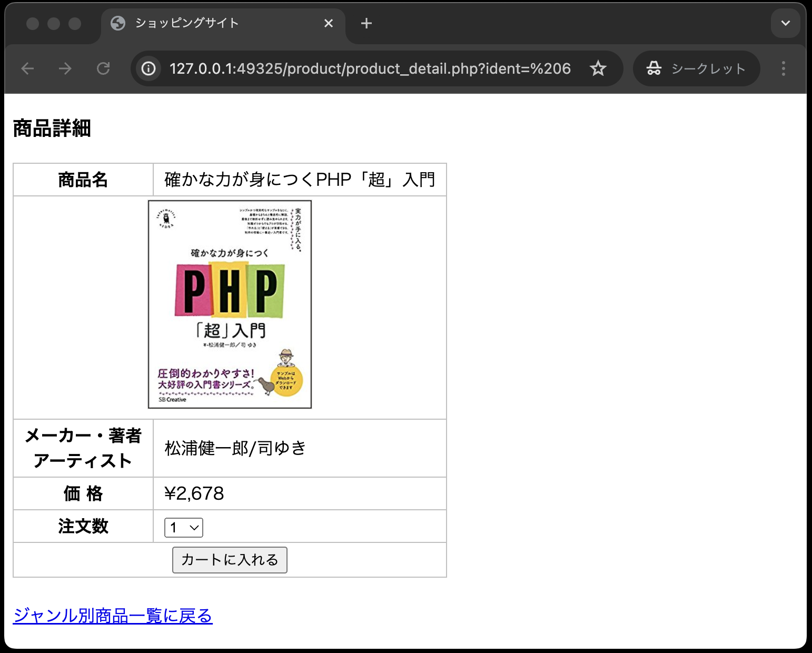

# 仕様書② : 商品詳細画面

## やること

本章では、以下の1つの画面を作成します。


また、商品詳細画面(`product_detail.php`)の作成だけでなく、商品データを操作するクラス`Product`の修正を行います。

## クラスProductの修正

商品詳細画面を表示するための処理の流れは以下のとおりです。

1. 送られてきた商品番号を受け取る
2. 受け取った商品番号のデータをテーブルitemsから抽出する
3. 抽出した商品データの結果セット(データは1件だけ)を受け取る
4. 商品データの結果セットから詳細画面を作成する

上記「2」と「3」の処理をクラス`Product`に実装します。<br>
商品詳細画面(`product_detail.php`) からは、クラス`Product`のオブジェクトを生成し、受け取った商品番号のデータを抽出するメソッドを呼び出して、商品データの結果セットを受け取るようにします。

そこでまず、クラス`Product`に以下の条件でメソッドを追加定義します。

```text
アクセス修飾子： public
メソッド名： getItem
引数： $ident(選択された商品番号)
戻り値： 抽出した商品データの結果セット(データは1件だけ)
```

**classes/product.php**

```php
// ---前の章で作成したコード(ここから)---
<?php
// スーパークラスであるDbDataを利用するため
require_once __DIR__ . '/dbdata.php';

// Productクラスの宣言
class  Product  extends  DbData
{
    // 選択されたジャンルの商品を取り出す
    public  function  getItems(string  $genre): array
    {
        $sql  =  "SELECT  *  FROM  items  WHERE  genre  =  ?";
        // DbDataクラスに定義したqueryメソッドを実行している
        $stmt = $this->query($sql,  [$genre]);
        // 抽出した商品データ(複数件)の結果セットを返す
        $items = $stmt->fetchAll();
        return  $items; 
    }
// ---前の章で作成したコード(ここまで)---

    // --- ここから追加 ---
    // 選択された商品を取り出す
    public  function  getItem(string  $ident): array
    {
        $sql  =  "SELECT  *  FROM  items  WHERE  ident  =  ?";
        $stmt = $this->query($sql,  [$ident]);
        // 1件だけ抽出するのでfetch( )メソッドを使用
        $item = $stmt->fetch();
        // 抽出した商品データを返す（1件だけ）
        return  $item;
    }
    // --- 追加はここまで ---
}
```

## 商品詳細画面(product_detail.php)

この画面の完成形は以下のとおりです。
(以下の画面は、ジャンル＝ブック、商品番号=6が選ばれた場合のサンプルです。)



完成形の画面、並びにコメントを参考に、以下の「`product_detail.php`」の**穴埋めの箇所に適切なコードを記述し**完成させてください。
また、「`product_detail.php`」は、`product`ディレクトリに配置してください。

**product/product_detail.php**

```php
<?php
// ジャンル別商品一覧から送られてきた商品番号を受け取る(穴埋め)
$ident = 
// product.phpを読み込む(穴埋め)
require_once
// Productオブジェクトを生成する(穴埋め)
$product = 
// 送られてきた商品番号で商品を抽出するメソッドを呼び出し、抽出された商品データを受け取る(穴埋め)
$item = 
?>
<!DOCTYPE html>
<html lang="ja">

<head>
  <meta charset="UTF-8">
  <meta name="viewport" content="width=device-width, initial-scale=1.0">
  <title>ショッピングサイト</title>
  <link rel="stylesheet" href="../css/minishop.css">
</head>

<body>
<h3>商品詳細</h3>
<!-- 「cart_add.php」はカートに商品を入れる処理を行うphp。以降の章で実装する。 -->
<form method="POST" action="../cart/cart_add.php">
  <!-- 商品番号をhiddenで送る(穴埋め) -->
  <input type="hidden" name="ident" value="<?=             ?>">
  <table>
    <tr>
      <th>商品名</th>
      <!-- 商品名を出力する(穴埋め) -->
      <td><?=            ?></td>
    </tr>
    <tr>
      <td colspan="2">
        <div class="td_center">
          <!-- imgタグを使い、商品画像を出力する(穴埋め) -->
          ">
        </div>
      </td>
    </tr>
    <tr>
      <th>メーカー・著者<br>アーティスト</th>
      <!-- メーカー・著者・アーティストを出力する(穴埋め) -->
      <td><?=             ?></td>
    </tr>
    <tr>
      <th>価 格</th>
      <!-- 価格を出力する、価格はカンマ(,)区切りにする必要がある。-->
      <!--「product_select.php」で同様のやり方をしているので参考にすること(穴埋め) -->
      <td>&yen;<?=            ?></td>
    </tr>
    <tr>
      <th>注文数</th>
      <td><select name="quantity">
          <?php
          for ($i = 1; $i <= 10; $i++) {
            echo '<option value="' . $i . '">' . $i . '</option>'; // ①
          }
          ?>
        </select></td>
    </tr>
    <tr>
      <th colspan="2"><input type="submit" value="カートに入れる"></th>
    </tr>
  </table>
</form>
<br>
 <!-- ジャンル別商品一覧画面に戻る際に使用する「ジャンル」のデータを併せて送る-->
<a href="product_select.php?genre=<?= $item['genre']; ?>">ジャンル別商品一覧に戻る</a>
</body>
</html>
```

**①: 注文数のプルダウンメニューを表示するコードについて**

```php
<select name="quantity">
<?php
  for ($i = 1; $i <= 10; $i++) {
    echo '<option value="' . $i . '">' . $i . '</option>';
  }
?>
</select>
```

注文数は「1 ～ 10」のプルダウンメニューで表示しますが、`for`分を使うことで、`<option>`タグの記述を簡略化できます。

## ジャンル別商品一覧画面(product_select.php)の修正

以上で商品詳細画面(`product_detail.php`)が完成ですが、ひとつ問題が発生します。<br>
それは、商品詳細画面(`product_detail.php`)の「ジャンル選択に戻る」リンクをクリックすると以下のエラーが発生することです。


このエラーは、ジャンル別商品一覧(`product_select.php`)で発生しています。

`Undefined array key "genre" ... on line3` と表示されていることから、3行目で`genre`というキーが配列にて定義されていないことが原因となっているようです。

3行目は、`$genre = $_POST['genre'];` となっており、ジャンル選択画面(`index.php`)からジャンルの値をPOSTで受け取るようになっています。

しかし、商品詳細画面(`product_detail.php`)の「ジャンル選択に戻る」リンクをクリックすると、ジャンルの値が`GET`で送られてくるため、`$_POST['genre']` ではなく `$_GET['genre']` で受け取る必要があります。

そのため、ジャンル別商品一覧(`product_select.php`)の3行目を以下のように修正してください。

**product/product_select.php**

```php
<?php
// ---修正箇所(ここから)---
// genreの値を受け取る
if ($_SERVER["REQUEST_METHOD"] === "POST") { // ①
  // POSTで送られてきた場合(※前回の仕様書で記述されていた箇所)
  $genre = $_POST['genre'];
} else {
  // GETで送られてきた場合
  $genre = $_GET['genre'];
}
// ---修正箇所(ここまで)---

// --- ここから先のコードは修正の必要はありません ---

// Productオブジェクトを生成する
require_once __DIR__ . '/../classes/product.php';
$product = new Product();

// 抽出された商品データの結果セットを受け取る
$items = $product->getItems($genre);
?>

<!DOCTYPE html>
<html lang="ja">

<head>
  <meta charset="UTF-8">
  <meta name="viewport" content="width=device-width, initial-scale=1.0">
  <title>ショッピングサイト</title>
  <link rel="stylesheet" href="./css/minishop.css">
</head>

<body>

<h3>ジャンル別商品一覧</h3>
<table>
  <tr>
    <th>&nbsp;</th>
    <th>商品名</th>
    <th>メーカー・著者<br>アーティスト</th>
    <th>価格</th>
    <th>詳細</th>
  </tr>
  <?php
  foreach ($items  as  $item) {
  ?>
    <tr>
      <td class="td_mini_img">"></td>
      <td class="td_item_name"><?= $item['name'] ?></td>
      <td class="td_item_maker"><?= $item['maker'] ?></td>
      <td class="td_right">&yen;<?= number_format($item['price'])?></td>
      <td><a href="product_detail.php?ident= <?= $item['ident'] ?> ">詳細</a></td>
    </tr>
  }
?>
</table>
<br>
<a href="../index.php">ジャンル選択に戻る</a>

</body>
</html>
```

**【解説】**

①: `$_SERVER["REQUEST_METHOD"] === "POST"`

`$_SERVER["REQUEST_METHOD"]`は、リクエストメソッドを取得するためのPHPの定義済み変数です。
`$_SERVER["REQUEST_METHOD"]`を使うことで、リクエスト時に送信されたデータのメソッド(主に`GET`や`POST`)を取得できます。

## ディレクトリ構成の確認

動作確認をする前に、ディレクトリ構成が以下のようになっていることを確認してください。

```text
public
├── classes
│   ├── dbdata.php
│   └── product.php
├── css
│   └── minishop.css
├── images(中のファイル名は省略)
├── index.php
└── product
    ├── product_detail.php ←本章で追加
    └── product_select.php
```

## 動作確認

以上の作業終了後、以下のように画面が表示されることを確認してください。

1. ジャンル＝パソコンの最初の商品(商品番号=1)を選択した場合<br>
   ジャンル別商品一覧画面と商品詳細画面が行き来できること<br>
   <br>
   <br>
   

1. ジャンル＝ブックの最初の商品(商品番号=6)が選択された場合
   ジャンル別商品一覧画面と商品詳細画面が行き来できること<br>
   <br>
   <br>
   

1. ジャンル＝ミュージックの最初の商品(商品番号=11)が選択された場合
   ジャンル別商品一覧画面と商品詳細画面が行き来できること<br>
   <br>
   <br>
   

## 課題の作成と提出

### ◆採点について

提出した課題はGitHub上で自動採点されます。
提出後、課題が合格しているかを確認してください。
合格していない場合は修正後pushし、再提出してください。

### ◆課題の合格基準

以下の3つを合格基準とします。

1. ジャンル別商品一覧画面(`product_select.php`)で、選択したジャンルの商品一覧が表示されること
2. 商品詳細画面(`product_detail.php`)で、ジャンル別商品一覧画面で選択した商品の詳細が表示されること
3. 商品詳細画面(`product_detail.php`)からジャンル別商品一覧画面(`product_select.php`)に遷移できること

### ◆合格確認方法

1. 本課題の[課題ページ]()に再度アクセスします。
2. 画面上部にある`Actions`をクリックしてください。<br>

1. **一番上**の行に、緑色のチェックが入っていればOKです。<br>

